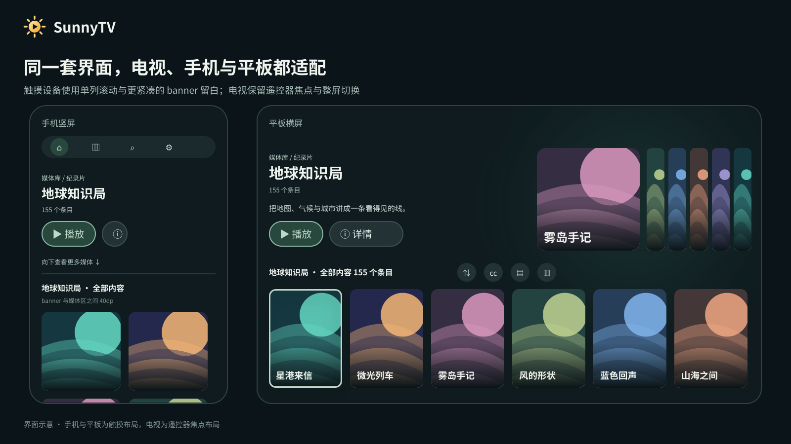

<p align="center"></p>
<h1 align="center">SunnyTV</h1>
<p align="center">让自己的媒体库，回到大屏。</p>

<p align="center">
  <a href="https://github.com/xudong7587/SunnyTV/releases/latest">下载最新版</a> ·
  <a href="docs/RELEASE-dev27.md">本版说明</a> ·
  <a href="docs/STATUS.md">开发状态</a> ·
  <a href="docs/KNOWN-ISSUES.md">已知问题</a> ·
  <a href="docs/BUILD.md">构建说明</a>
</p>

SunnyTV 是基于 Kotlin、Compose for TV 与 Media3 的原生 Android 客户端，以 Emby 为主要媒体来源，
同时保留 MediaIndex STRM / 重定向播放与 CloudDrive2 WebDAV 兼容能力。应用不内置任何影视内容，
需要连接你自己的媒体服务；海报、背景、透明片名 Logo 与单集封面都直接复用 Emby 已有素材，不重新刮削。

**电视与手机/平板同一套界面**：电视保留遥控器焦点导航与「banner ↔ 媒体区」整屏切换；
手机与平板改为可触摸的单列滚动，并收紧了 banner 与媒体区之间的留白。

## 亮点

- **流畅**：焦点与滚动按遥控器节奏设计——整屏切换只做 GPU 平移，网格跨行先交接焦点再滚动，
  详情页进入即停在「播放 / 继续播放」上、按上回顶部导航、再按下回到按钮，连续按键不丢焦点、不抖屏。
- **美观**：深浅主题 + 十组重点色，海报墙、banner、详情页与播放器共用同一套渐变、柔光与留白；
  焦点框与卡片圆角同心，行内预留阴影空间，聚焦不改变卡片几何。
- **STRM 支持好**：STRM 一律按「文件内唯一一条 HTTP(S) 地址」处理，支持 302/重定向、带签名的直链与
  Emby 服务端取流；电视直连失败时自动改用 Emby 服务端读一次，失败原因写到能看懂（主机 + 阶段）。
- **大视频与高码率体验**：播放传输单独放宽首次响应预算（连接 15 秒 / 读取 60 秒），缓冲按物理内存配置，
  首帧前的瞬时传输失败自动重试一次；原画直放优先，不申请转码。
- **字体与界面大小自定义**：可导入自己的 TTF / OTF / TTC 作为界面或字幕字体，
  界面缩放、字号、字幕外观（描边 / 位置 / 背景 / 大小）与动画速度都能单独调整。
- **多端自适应**：同一份界面适配电视（遥控器焦点导航）与手机 / 平板（单列触摸滚动），
  横竖屏、安全区与「按文件夹 / 按海报」浏览方式自动处理。
- **性能优化**：启动快照缓存、图片按「来源 + 条目 + 类型 + tag + 尺寸」缓存、低负载模式与界面分辨率偏好，
  低内存设备自动降低解码尺寸与阴影绘制。

## 主要功能

- **首页**：一大一小两段式 banner 轮播（随机推荐 / 最新入库 / 继续观看），按「上」或下拉可换一批；
  下方是「我的媒体库」与每个媒体库的最新入库行。
- **媒体库**：banner 推荐 + 工具行 + 海报墙。每个媒体库独立保存展示方式（海报 / 背景 / 横幅）、
  排序（最新入库 / 最新上映 / 随机）、字幕优先级、单集排布与「按文件夹」浏览。
- **详情页**：简介、版本（多资源）、演职员表、相似推荐与全部剧集，可标记已看/收藏并写回 Emby。
- **播放器**：Media3 直连与 STRM/重定向播放、音轨与字幕轨道选择、章节、片头/片尾跳过提示、
  1x / 1.25x / 1.5x / 2x 倍速、字幕外观（字体、大小、描边、位置、背景，带实时预览）、
  电视遥控器长按左右连续快进快退、手机分区手势（亮度/音量/进度）与双击控制。
- **外观**：深浅主题、十组重点色、五档界面大小与独立字号、五档动画速度与完全关闭。
- **字体**：系统默认字体，或自己导入 TTF / OTF / TTC（只保存在本机）。**仓库与安装包不含任何字体文件。**
- **搜索**：遥控器键盘 + 本地拼音首字母匹配（输入 `sdyq` 可命中「速度与激情」，无需联网、不内置词典）。
- **云盘**：CloudDrive2 WebDAV 只读浏览与播放，不提供删除、移动、重命名。
- **性能**：启动快照缓存、图片按「来源 + 条目 + 类型 + tag + 尺寸」缓存、低负载模式、界面分辨率偏好。

## 界面示意




以上均为界面示意图：片名、简介、年份、评分、进度与海报图形全部是原创虚构数据，未使用任何真实影视素材，
也不是用户媒体库截图；图形由 [本地脚本](scripts/generate-readme-art.py) 生成（纯手写 SVG，无外部图片、字体或网络请求）。

## 快速开始

需要 JDK 17 或 21 与 Android SDK 35（`platforms;android-35`、`build-tools;35.0.0`）。

```bash
./gradlew assembleDebug testDebugUnitTest lintDebug
```

Windows 用 `gradlew.bat`。发布包在 [Releases](https://github.com/xudong7587/SunnyTV/releases) 下载，
或安装刚构建出来的调试包：

```bash
adb install -r app/build/outputs/apk/debug/app-debug.apk
```

首次使用进入「设置 → 媒体来源」填写 Emby 地址与账号；云盘填 CloudDrive2 的 **WebDAV** 地址
（不是管理后台地址）。凭据按来源保存，只在本机。

## 验证状态（0.1.0-dev27）

| 项目 | 结果 |
| --- | --- |
| 单元测试 | 72 项方法全部通过（纯 Kotlin 契约检查 165/165） |
| `lintDebug` | 0 错误 / 28 警告 |
| Android 编译与测试 APK | `assembleDebug`、`assembleDebugAndroidTest`、`assembleRelease` 均通过 |
| 模拟器交互测试（API 30） | 65 项执行，6 项是落后于现有界面行为的旧断言，见 [已知问题](docs/KNOWN-ISSUES.md) |
| 发布签名 | 使用仓库既有签名 Secret 签名并校验证书一致；[签名策略](docs/SIGNING.md) |
| 实体设备 | 电视端交互与手机/平板触摸布局已由使用者人工验收；HDR、杜比、高帧率与部分机型的播放兼容性未验证 |

本版改动记录：[详情焦点、排序窗口、裁切与搜索布局](docs/UI-DEV27.md)；更早的轮次见 [docs/](docs) 与 [CHANGELOG.md](CHANGELOG.md)。

## 实现取向

- 页面全部是原生 Compose / Media3，**不用 WebView 承载任何主页面**。
- 网络策略集中在 `core/network`（来源与路径作用域凭据、有界重定向、严格 TLS、统一播放 UA、可取消请求、不记录签名 URL）。
- API URL 只在 `source/` 适配器里拼装，UI 不直接构造接口地址，播放器不接触云盘 Cookie。
- 焦点效果不改变卡片几何；柔和阴影用缓存的轮廓描边带绘制，描边与卡片圆角同心，行内预留阴影留白。
- 多来源互不合并：同一时间只显示所选 Emby 来源，切换来源不影响缓存与配置。

主要目录：

```
app/src/main/java/io/github/xudong7587/sunnytv/
  core/model     展示逻辑、设置模型、策略（纯 Kotlin，可单测）
  core/network   HTTP 策略与安全传输
  core/storage   配置、字体、启动快照
  core/playback  播放会话、进度回报、启动计时
  feature/ui     首页、媒体库、详情、设置等界面
  feature/player 播放器与手势
  source/emby    Emby 适配器（含元数据与图片 URL）
  source/clouddrive, source/strm  WebDAV 与 STRM / 重定向
```

## 已知限制

- 模拟器验证不等于实体电视验收；真实设备上的遥控器手感、触摸手感与高码率播放仍需实机反馈。
- 8 项仪器化断言落后于已被验收的界面行为，未通过跳过测试的方式掩盖，逐条列在 [docs/KNOWN-ISSUES.md](docs/KNOWN-ISSUES.md)。
- 云端只读：不做删除、移动、重命名；应用内不提供文件管理。

## 开源许可

原创代码与原创示意图采用 [GPL-3.0-only](LICENSE)。分发修改后的版本须遵守 GPL 的源码提供、
许可证与署名保留要求；GPL 允许商业使用。第三方组件的许可证见 [第三方声明](THIRD_PARTY_NOTICES.md)。
