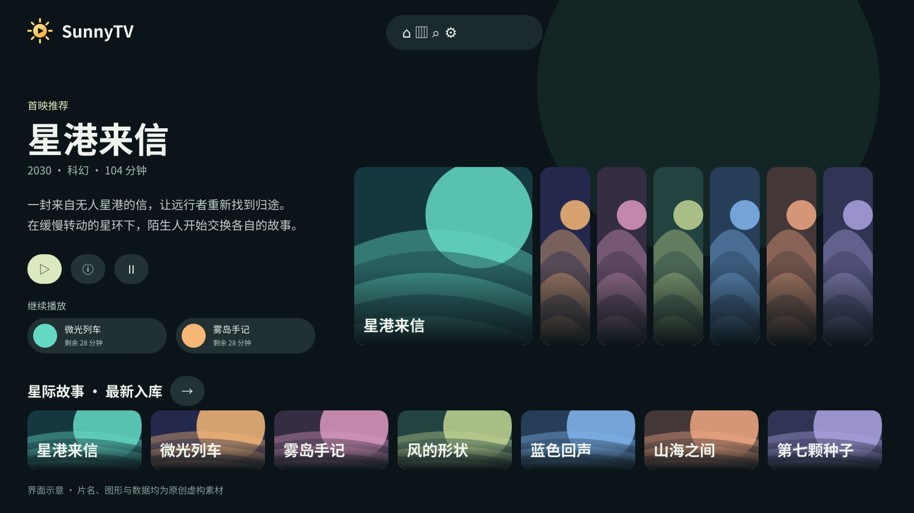
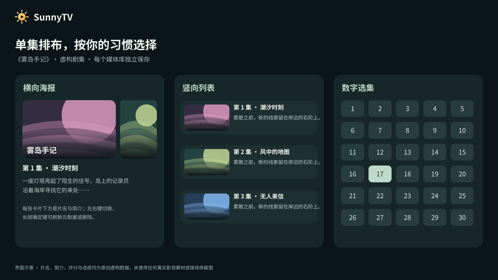
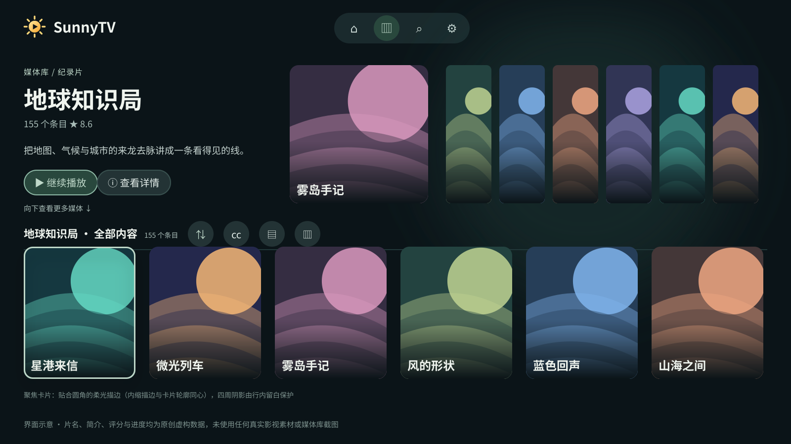

<p align="center"></p>
<h1 align="center">SunnyTV</h1>
<p align="center">让自己的媒体库，回到大屏。</p>

## 项目亮点

- 为 TV 横屏设计的原生界面，支持遥控器焦点导航、轮播推荐、继续观看和按库浏览。
- 使用 Emby 已有的海报、背景、透明片名 Logo 与单集封面，保留观看进度和收藏状态。
- 单集支持横向海报、竖向简介和数字选集三种排布，各媒体库可独立保存展示方式。
- 深浅主题、十组重点色与五档界面大小；图片按显示密度请求，并限制共享缓存开销。
- 手机竖屏自适应，播放页支持分区亮度、音量、进度手势和双击控制。







以上均为界面示意图，片名、简介、年份、海报图形和进度全部为原创虚构数据，未使用真实影视素材或用户媒体库截图。图形由 [本地脚本](scripts/generate-readme-art.py) 生成。

## 简单介绍

SunnyTV 是基于 Kotlin、Compose TV 和 Media3 的 Android 媒体客户端，以 Emby 为主要媒体来源，也保留 MediaIndex STRM / 重定向播放与 CloudDrive2 WebDAV 兼容能力。应用不内置影视内容，需要连接自己的媒体服务。

当前发布为 **0.1.0-dev7 开发测试版**。本机 Android 构建、单元测试和 lint 已通过；电视兼容性、4K 实际帧率、HDR 与音频能力仍需按设备验证，详见 [开发状态](docs/STATUS.md)。

[下载开发版](https://github.com/xudong7587/SunnyTV/releases/tag/v0.1.0-dev7) · [本轮更新](docs/UI-DEV7.md) · [构建说明](docs/BUILD.md)

本地构建需要 JDK 17 或 21、Android SDK 35：

```bash
./gradlew assembleDebug testDebugUnitTest lintDebug
```

Windows 使用 `gradlew.bat`。测试 APK 使用 `.debug` 包名和 debug 签名。

## 开源许可

原创代码与原创示意图采用 [GPL-3.0-only](LICENSE)。分发修改后的版本须遵守 GPL 的源码提供、许可证及署名保留要求；GPL 允许商业使用。第三方组件保留各自许可证，详见 [第三方声明](THIRD_PARTY_NOTICES.md)。
